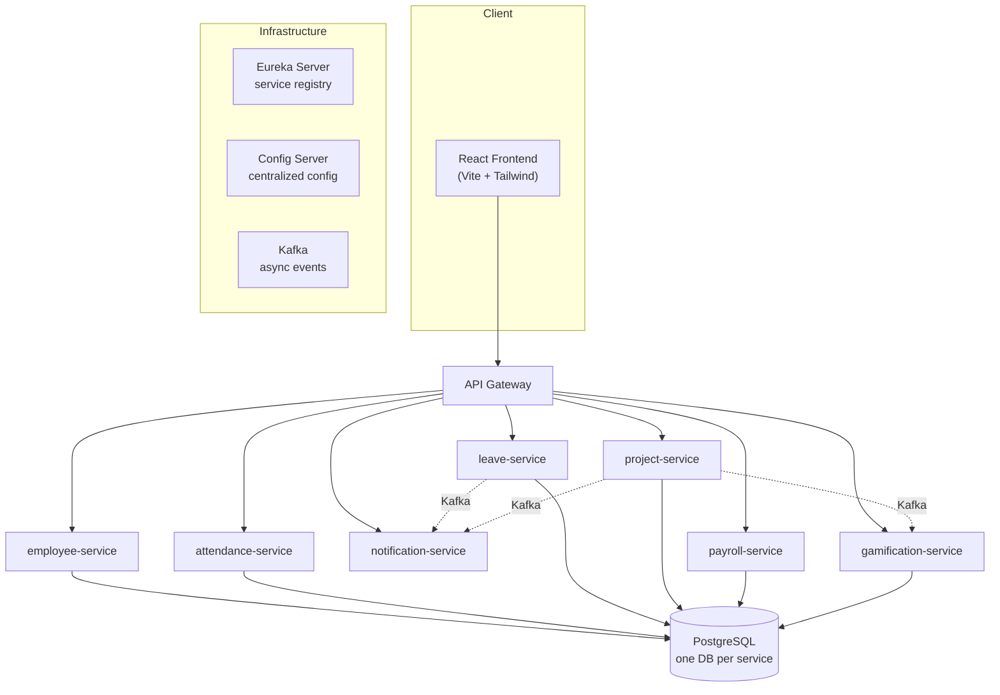

# Taurus Go

A multi-tenant HR Operations SaaS — attendance, leave, project & task management, payroll, and
gamification — built as a Spring Boot microservices system with a React frontend.

**Live demo:** [taurus-go.netlify.app](https://taurus-go.netlify.app)
**Backend:** [hr-saas-microservices.onrender.com](https://hr-saas-microservices.onrender.com)

> The live deployment runs the `project-service` (auth, multi-tenant companies, projects, tasks) on
> a free-tier host — it can take 30-50s to wake up on the first request. The full 10-service
> architecture below (attendance, payroll, gamification, real-time notifications, distributed
> tracing) runs via a single `docker-compose up` locally.

---

## What it does

- **Multi-tenant workspaces** — one company signs up, invites teammates, everything is scoped by
  `companyId` pulled from a verified JWT (never trusted from client headers)
- **Google OAuth login** + our own signed JWT (HS256) issued after verification
- **Role-based access control** — ADMIN / MANAGER / EMPLOYEE, enforced per-endpoint
- **Projects & tasks** — multi-assignee tasks, ownership rules, Kafka-driven notifications on
  assignment, workload analytics
- **Attendance & leave** — check-in/out, leave requests with an approval workflow
- **Payroll** — salary structures, paid-leave policies, branded PDF payslip generation
- **Gamification** — XP, streaks, and badges re-keyed per company/user
- **Real-time notifications** — WebSocket (STOMP/SockJS) + Kafka fan-out
- **Platform console** — cross-tenant admin view, gated to platform-owner emails only

## Architecture



| Service | Responsibility |
|---|---|
| `api-gateway` | Single entry point, routing via Eureka |
| `eureka-server` | Service discovery / registry |
| `config-server` | Centralized configuration for all services |
| `employee-service` | Employee profiles, onboarding |
| `attendance-service` | Check-in/check-out records |
| `leave-service` | Leave requests + approval workflow |
| `notification-service` | Kafka consumer, WebSocket push to clients |
| `project-service` | Auth, companies, projects, multi-assignee tasks |
| `payroll-service` | Salary structures, payslip generation (PDF) |
| `gamification-service` | XP, streaks, badges |

## Tech stack

**Backend** — Java 21, Spring Boot 3.5, Spring Cloud (Eureka, Config Server, OpenFeign), Kafka,
PostgreSQL, JWT (jjwt), Google API Client, Docker

**Frontend** — React, Vite, TailwindCSS, React Query, Axios, `@react-oauth/google`

**Observability** — Micrometer + Prometheus, Zipkin distributed tracing

**Deployed on** — Render (Docker), Neon (serverless Postgres), Netlify

## Running locally

```bash
# 1. copy env template and fill in secrets
cp .env.example .env

# 2. start everything (infra + all services + frontend build)
docker-compose up --build
```

Services register with Eureka at `localhost:8761`; the frontend dev server proxies `/api/*` to the
right service per route (see `worktrack-frontend/vite.config.js`).
